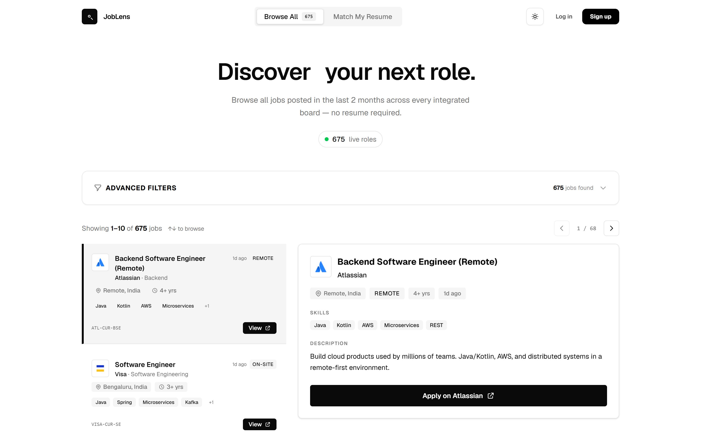
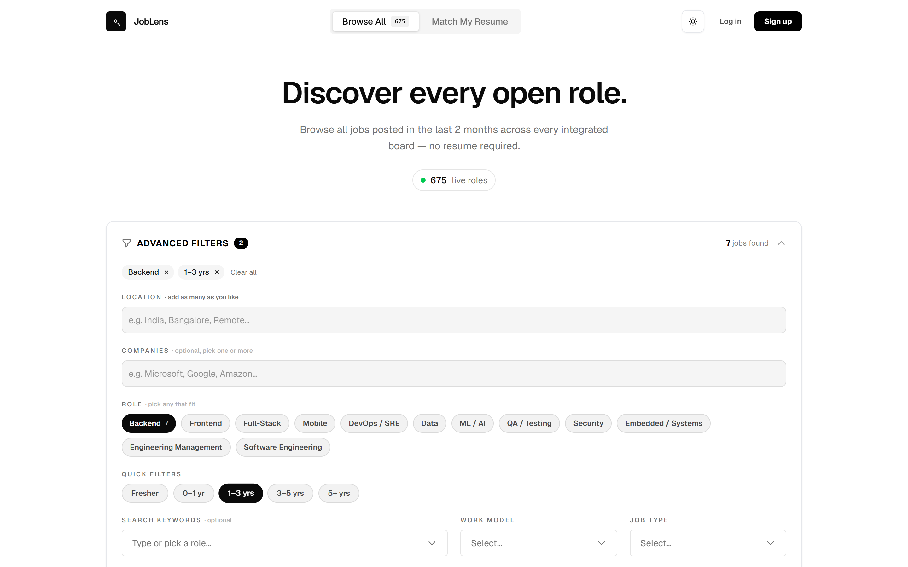
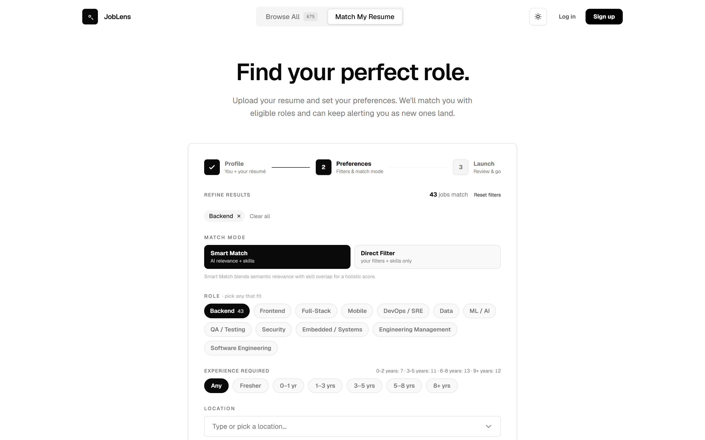

# JobLens — Résumé-to-Roles Matching Platform

> Upload a résumé and JobLens surfaces the roles that actually fit — ranked by a
> two-pass engine combining **pgvector semantic similarity** with skill overlap,
> across multiple live career portals.

**🔗 Live demo:** [joblens-match.vercel.app](https://joblens-match.vercel.app) · **API + Swagger docs:** [joblens-api-xi3l.onrender.com/api/docs](https://joblens-api-xi3l.onrender.com/api/docs)

`FastAPI` · `SQLAlchemy 2.0` · `PostgreSQL + pgvector` · `Celery` · `Next.js 16` · `Tailwind v4` · `TypeScript` · `framer-motion`

> ℹ️ The backend runs on a free Render instance that sleeps after ~15 min idle.
> Cold starts show an **animated waking screen** while the app retries in the
> background — content appears by itself once the server is up (~30–50 s).

📚 **Docs:** [Architecture](ARCHITECTURE.md) · [API reference](API.md) · [Deployment guide](DEPLOY.md) · [Contributing](CONTRIBUTING.md)

---

## Screenshots

**Browse — LinkedIn-style split view over 675+ live software roles**



**Adaptive filters — role taxonomy with live counts, removable pills, live result count**



**Match wizard — Amazon-style facets with a live "N jobs match" preview**



---

## What it does

- **Résumé upload → structured parse → embedding.** A PDF is parsed into a
  structured profile by **Gemini Flash structured extraction** (JSON-schema
  output: title, years, categorised skills, domains, education) with a
  deterministic regex fallback so uploads never break on provider issues —
  then embedded into a 384-dim vector. Production embeddings come
  from **Gemini (`gemini-embedding-001`)** — résumés embed as retrieval
  *queries* and jobs as retrieval *documents*, MRL-truncated to 384 dims and
  re-normalised, so real semantic vectors fit the same pgvector schema (and the
  free hosting tier, since inference is an API call rather than a local model).
- **Two matching modes.**
  - **Smart Match** — `0.6 × semantic (pgvector cosine) + 0.4 × skill overlap`.
  - **Direct Filter** — skill-overlap only, driven by the user's hard filters
    (location/experience/etc.); avoids letting an approximate semantic signal
    depress scores when a job description omits explicit skills.
  Both apply an experience hard-filter first, then rank.
- **Alias-aware skills.** A canonical normalizer means `JS↔JavaScript`,
  `k8s↔Kubernetes`, `postgres↔PostgreSQL` all count as the same skill, with a
  plain-English "why this matched" explanation per result.
- **Role taxonomy + tech-only catalogue.** Every title is classified into a
  12-category software-engineering taxonomy at ingestion (Backend, Frontend,
  DevOps/SRE, ML/AI, …); non-engineering postings from company boards are
  dropped at the door. Metadata stays honest — `job_type`/`industry` are only
  set when the source reports them, never fabricated.
- **India-focused, multi-source ingestion, cost-tiered.** 11 live Indian ATS
  boards (Paytm, PhonePe, Meesho, Razorpay, Dream11, Groww, InMobi, …) +
  India-filtered global MNC boards (Okta, MongoDB, Twilio, Elastic, GitLab, …)
  via per-portal location allowlists, plus the Adzuna aggregator with
  company-targeted queries for no-API employers (Flipkart, Swiggy, Zomato, …)
  and LinkedIn/Indeed via Apify pay-per-result actors (weekly, cost-guarded) —
  all normalised behind one schema; every posting keeps a real apply URL.
- **Adaptive, Amazon-style filters.** Role-taxonomy chips and facets with
  **live result counts**, removable active-filter pills, one-tap experience
  presets, and a live "N jobs match" preview in the match wizard — options
  with zero results hide themselves.
- **Continuous alerts.** Subscribe a résumé and a scheduled worker pushes only
  the *new* matches over time. In the free-tier deploy the schedule is driven
  by a GitHub Actions cron (nightly catalogue refresh + role backfill +
  stale-job cleanup, daily/weekly alert runs) hitting key-protected
  maintenance endpoints.
- **Freshness that tracks reality.** Every re-scrape refreshes a job's
  `last_seen_at`; date filters and stale-job deactivation key off "still live
  in the feed", not "first scraped" — long-running postings never falsely age
  out.

## Architecture

```
Next.js 16 (Vercel)  ──HTTPS──▶  FastAPI (Render)  ──▶  PostgreSQL + pgvector (Neon)
  App Router, Tailwind v4,           domain-driven           HNSW vector index
  framer-motion, bearer-token        services + Celery        for ANN search
  session in localStorage            workers (alerts)
```

**Backend is domain-driven** — each domain (`candidates`, `resumes`, `jobs`,
`matching`, `subscriptions`, `ingestion`, `health`) is a self-contained
`models · schemas · repository · service · router` slice. A dialect-aware type
layer (`core/types.py`) lets the *same* models run on Postgres (prod) and SQLite
(local dev) with no `if`-branching.

```
backend/app/
  core/        config · database · types (GUID/JSONType/Vector) · security · ratelimit · exceptions
  domains/<x>/ models · schemas · repository · service · router
  services/    embedding (pluggable provider) · parsing · skills · roles (all pure, infra-free)
  workers/     celery app · tasks · beat schedules
  scripts/     seed_prod · backfill_roles · reembed (also exposed as key-protected endpoints)
  alembic/     migrations own the Postgres schema
frontend/src/
  app/         pages, theme, icon
  components/  filters (facets + pills) · job cards · wizard · waking screen · drawer
  lib/         api client (cold-start-aware) · session · backend-status hook · motion
```

## What this project demonstrates

- **System design:** clean layering, a repository pattern, race-safe upserts
  (`INSERT … ON CONFLICT`), and a single schema that targets two databases.
- **Applied ML/IR:** real Gemini embeddings with asymmetric task types
  (query vs document), approximate-nearest-neighbour search over pgvector, and
  a transparent, weighted scoring function — behind a pluggable provider so
  tests/CI run fully offline on deterministic vectors.
- **Production thinking:** Alembic-owned schema, env-driven config with a
  production-secret guard, CORS, bearer-token auth scoping résumé PII, per-IP
  rate limiting on auth/upload, SSRF-guarded webhook destinations, an async SSE
  status stream, and a memory-aware deploy (API-based embeddings — no torch —
  for free-tier hosting, with batched, rate-limit-aware re-embedding and role
  backfill via key-protected endpoints).
- **Frontend craft:** a cohesive monochrome dark/light design system (shadcn-ui
  tokens + CSS variables, light by default), real-favicon company avatars,
  accessible custom comboboxes, live résumé-status streaming (SSE), a
  cold-start waking screen with self-retrying fetches, and purposeful,
  restrained motion.

## Run locally (no Docker required)

```powershell
# Backend — SQLite + in-process tasks + deterministic embeddings
cd backend
pip install -r requirements-dev.txt
python ../scripts/seed_local.py     # seed real, URL-bearing jobs (free sources; --all adds paid)
./run_local.ps1                     # http://localhost:8000/api/docs

# Frontend
cd frontend
npm install
npm run dev                         # http://localhost:3000
```

The committed production stack (Postgres + pgvector + Redis/Celery) also runs
end-to-end via `docker-compose up`.

## Tests

```bash
cd backend && EMBEDDING_PROVIDER=deterministic ENVIRONMENT=local pytest
cd frontend && npm run lint && npm run build
```

## Deployment (free tier)

Hosted across three free services — see [DEPLOY.md](DEPLOY.md) for the
step-by-step guide:

| Layer | Host | Notes |
|-------|------|-------|
| Database | **Neon** | free Postgres **with pgvector** |
| Backend | **Render** | free web service; `render.yaml` blueprint included |
| Frontend | **Vercel** | free Next.js hosting |

---

Built by [Yoginder](https://github.com/Yoginder007).
